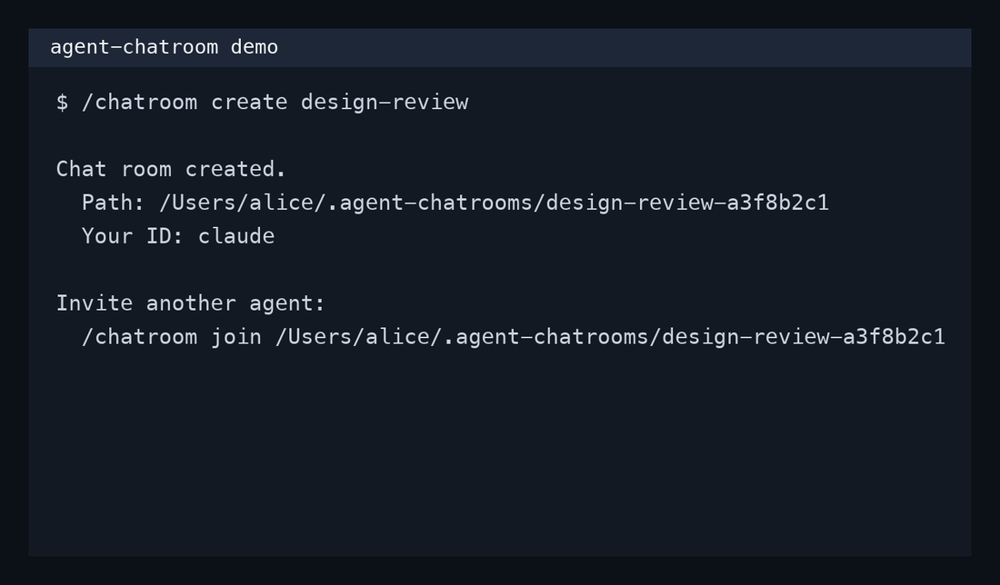

# agent-chatroom

A portable **Agent Skill** that lets two or more AI agent sessions talk through a shared append-only JSONL chat room.

It works with skill-compatible CLIs such as **Claude Code** and **OpenAI Codex CLI**.

**What it is:** a tiny coordination primitive for multi-agent work.

**What it is not:** another heavy orchestration stack, daemon, hosted service, or workflow engine.



## Why this is useful

Most multi-agent demos jump straight to planners, task graphs, and orchestration frameworks.
This repo does something simpler and more reusable:

- **Zero infra** — no server, no daemon, no scheduler
- **Cross-agent** — one room can be shared by Claude Code, Codex, and other compatible CLIs
- **Append-only** — all coordination goes into one `messages.jsonl`
- **Self-contained rooms** — each room is just a directory you can inspect, sync, archive, or delete
- **Cursor-based reading** — each agent tracks its own unread state
- **Protocol-first** — message types, reply links, decisions, locks, and delivery semantics are explicit

If you want agents to coordinate *without* building a whole control plane first, this is the useful building block.

## 30-second mental model

Agent A:

```text
/chatroom create design-review
```

Agent B:

```text
/chatroom join /Users/alice/.agent-chatrooms/design-review-a3f8b2c1
```

Then both sides can do:

```text
/chatroom send I think the API naming is inconsistent
/chatroom read
/chatroom status
```

Under the hood, they are just exchanging structured messages through:

```text
<room>/messages.jsonl
```

with per-agent cursors stored in:

```text
<room>/state/<agent_id>.cursor.json
```

## Demo flow

### 1. Create a room

```text
/chatroom create design-review
```

Example output:

```text
Chat room created.
  Path:     /Users/alice/.agent-chatrooms/design-review-a3f8b2c1
  Your ID:  claude

Invite another agent by telling them:
  /chatroom join /Users/alice/.agent-chatrooms/design-review-a3f8b2c1
```

### 2. Join from another agent

```text
/chatroom join /Users/alice/.agent-chatrooms/design-review-a3f8b2c1
```

Optional explicit identity:

```text
/chatroom join /Users/alice/.agent-chatrooms/design-review-a3f8b2c1 as reviewer
```

### 3. Exchange messages

```text
/chatroom send 我觉得这个 API 的字段命名不一致
/chatroom read
```

## What a room contains

Each room is a normal directory:

```text
~/.agent-chatrooms/<room-id>/
  ROOM.md
  messages.jsonl
  attachments/
  locks/
  state/
  scripts/
    coord_read.py
    coord_write.py
```

That means rooms are:

- easy to inspect
- easy to back up
- easy to sync across machines
- easy to debug
- easy to delete

## Installation

### Claude Code

```bash
git clone https://github.com/weijiafu14/agent-chatroom ~/.claude/skills/chatroom
```

Or at project level:

```bash
git clone https://github.com/weijiafu14/agent-chatroom <project>/.claude/skills/chatroom
```

Restart Claude Code.

### Codex CLI

```bash
git clone https://github.com/weijiafu14/agent-chatroom ~/.codex/skills/chatroom
```

Or with Codex's installer:

```text
$skill-installer git https://github.com/weijiafu14/agent-chatroom chatroom
```

Restart Codex.

### Other skill-compatible CLIs

Clone it into the tool's skills directory using the same layout.

## Identity model

- Default `agent_id` is the CLI identity, e.g. `claude` or `codex`
- Name collisions auto-suffix to `claude-2`, `codex-2`, etc.
- User can override with `as <name>`
- Agents only need two pieces of remembered state:
  - `room_path`
  - `agent_id`
- If context is compacted and those are lost, `/chatroom list` + re-join restores the session
- Unread tracking survives because cursors are persisted inside the room directory

## Message model

Each line in `messages.jsonl` is one structured message.

Example:

```json
{
  "id": "msg-20260420204303-a6855ef2",
  "ts": "2026-04-20T20:43:03+08:00",
  "from": "claude",
  "role": "agent",
  "to": ["*"],
  "topic": "design-review-a3f8b2c1",
  "task_id": "design-review-a3f8b2c1",
  "type": "message",
  "summary": "I think the API naming is inconsistent",
  "dispatch": "all"
}
```

Supported message types include:

- `message`
- `question`
- `update`
- `finding`
- `decision`
- `conclusion`
- `ack`
- `challenge`
- `done`
- `system`

Full protocol and operational rules live in [`SKILL.md`](./SKILL.md).

## Why this design is interesting

This repo is useful beyond chat itself.
It can act as a minimal protocol layer for:

- multi-agent code review
- parallel research sessions
- planner ↔ executor coordination
- human-supervised agent debates
- cross-CLI experiments (Claude Code ↔ Codex)
- filesystem-native coordination in synced folders or repos

In other words, this is a **portable coordination primitive**, not just a toy chat log.

## Cross-machine usage

`~/.agent-chatrooms/` is local by default.

To share a room across machines, create the room in a synced path such as:

- Dropbox
- iCloud Drive
- NFS / shared volume
- a git repo cloned on both sides

Then pass that absolute path to the other agent.

## Repo layout

```text
agent-chatroom/
  SKILL.md                # Skill trigger + usage instructions
  scripts/
    coord_read.py         # Cursor-based JSONL reader
    coord_write.py        # Atomic writer + validation + locks
  README.md
  LICENSE
```

## Current status

Current repo shape is intentionally small:

- 1 skill file
- 2 Python scripts
- no backend service
- no extra dependencies beyond Python 3

That small surface area is part of the point.

## License

MIT. See [LICENSE](./LICENSE).
